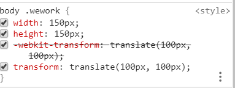

## loader

对于后缀名不是 `.js` 的文件，都要通过 `loader`去打包

### 图片打包

### file-loader

下面实例一下图片的打包——

#### 01.下载 `file-loader`

```
cnpm install file-loader -D
```

#### 02.添加 `webpack` 配置文件

`webpack.config.js`

```
module: {
        rules: [{
            pic: /\.jpg$/,
            use: {
                loader: 'file-loader'
            }
        }]

    },
```

#### 03.打包

```
npm run bundle
```

#### file-loader本质

把打包的文件，复制到dist目录下，同时可以通过

```
var picture = require('../asset/wework.jpg')
```

获得图片当前的地址。

#### module本质(webpack.config.js)

标记出webpack不认识的文件，标明打包工具。

编译 `.vue` 文件同理。下面取自vue项目的 `webpack.base.conf.js`

```
rules: [
      {
        test: /\.vue$/,
        loader: 'vue-loader',
        options: vueLoaderConfig
      },
```

### 02.配置——loader

#### placeholder(规定打包后的图片名称)

在options里面加上 `name: '[name].[ext]'`，使得打包出来的图片名称和图片格式，和打包前的一样。

```js
module: {
        rules: [{
            test: /\.jpg$/,
            use: {
                loader: 'file-loader',
                // placeholder占位符
                options: {
                    name: '[name].[ext]'
                }
            }
        }]

    },
```

也可以带上哈希值

```js
module: {
        rules: [{
            test: /\.(jpg|png|gif)$/,
            use: {
                loader: 'file-loader',
                // placeholder占位符
                options: {
                    name: '[name]_[hash].[ext]',
                    outputPath: 'images/',
                    limit: 2048
                }
            }
        }]

    },
```

关于 `file-loader` 的配置参数 —— <https://webpack.js.org/loaders/file-loader/>

#### outputPath(规定打包后的文件路径)

参数解释，当遇到jpg, png, gif 后缀的图片，打包到images文件夹下面。

```js
 module: {
        rules: [{
            test: /\.(jpg|png|gif)$/,
            use: {
                loader: 'file-loader',
                // placeholder占位符
                options: {
                    name: '[name]_[hash].[ext]',
                    outputPath: 'images/',
                    limit: 2048
                }
            }
        }]

    },
    out
```

### url-loader

#### (把图片打包成base64的格式)

如果太大的图片，打包到JS文件中，会导致页面阻塞，拖慢页面的加载速度。所以，只将小于2kb的图片打包到JS文件中。对于大于2kb的图片，将被打包到images文件中。

```js
module: {
        rules: [{
            test: /\.(jpg|png|gif)$/,
            use: {
                loader: 'url-loader',
                // placeholder占位符
                options: {
                    name: '[name]_[hash].[ext]',
                    outputPath: 'images/',
                    limit: 2048
                }
            }
        }]

    },
```

加上 `limit` 参数以后，如果图片小于2048b (2kb) 就会被转化为base64的格式，保存在打包后的文件中。

如果图片大于2048b (2kb)，就会被复制到dist文件夹中。

### 样式打包

### CSS

1.下载 `css-loader` , `style-loader`

```
cnpm install style-loader css-loader -D
```

2. rules数组里再加入一个对象

```js
rules:[{
   test:/\.css$/,
   use:['style-loader','css-loader']
}]
```

3.运行打包命令

```
npm run bundle
```

#### 打包过程详解

css-loader，负责合并引用的css文件; 比如下面这种，

`index.css`

```
@import './style/wework.css'
```

`wework.css`

```
.wework{
    width:150px;
    height:150px;
}
```

style-loader ，把全部的样式塞到html文件head下面的style标签中。

### SCSS

官网查找sass-loader, 有详细的依赖安装指南和配置参考。

注意，loader的顺序，webpack的loader是有执行顺序的，不要搞错顺序。执行顺序为，从下到上，从右到左。

#### 特殊处理CSS3

参考webpack文档，postcss-loader

1.创建 `postcss.config.js` , 安装autoprefixer

```
module.exports = {
    plugins: [
        require('autoprefixer')
    ]
  }
```

2.再次执行打包命令，对于SCSS中的CSS3自动产生厂商前缀

例如

```
body{
    .wework{
        width: 150px;
        height: 150px;
        transform: translate(100px, 100px);
    } 
}
```

页面展示



### importLoaders

```
{
            test:/\.scss$/,
            use:['style-loader',{
                loaders:'css-loader',options:{
                    importLoaders:2
                }
            },'postcss-loader','sass-loader']
        }
```

此处，加入importLoaders的目的，是确保在 `scss` 中引用的 `scss` 文件

```
@import './avatar.scss'
```

也会经过 `postcss-loader` 和 `sass-loader` 的打包。

如果此处不加 `importLoader` , 那么在 `scss` 中引用 `scss` 可能会报错。

### CSS模块化

为了防止，CSS对引入模块的样式产生影响。

尝试在`index.js` 中，加入两段代码，用于插入图片。

`index.js`

```js
import './scss/index.scss'
import wework from '../asset/wework.jpg'
import createAvatar from './js/createAvatar' 

createAvatar();
var img = new Image();
img.src = wework;
img.classList.add('wework')
var root = document.getElementById('root')
root.append(img)
```

`createAvatar.js`

```js
import wework from '../../asset/wework.jpg'
function createAvatar(){
    var img = new Image();
    img.src = wework;
    img.classList.add('wework')

    var root = document.getElementById('root')
    root.append(img)
}
export default createAvatar;
```

#### 表现

页面出现两张图片，`index.scss` 的样式对引入的子模块`createAvatar` 也生效了。

### 实现模块化

因此，为了防止污染子模块，在options中加入 `modules:true`

```js
{
            test:/\.scss$/,
            use:['style-loader',{
                loader:'css-loader',options:{
                    importLoaders:2,
                    modules:true
                }
            },'postcss-loader','sass-loader']
        }
```

此时，要引入 `index.scss` 的样式，`index.js` 代码改成这样

```js
import style from './scss/index.scss'
...
img.classList.add(style.wework)
```

`createAvatar` 代码保持不变。

#### 表现

`createAvatar` 插入的图片，样式不生效。`index.js` 中插入的图片，样式生效。

### 字体图标库

以阿里巴巴的iconfont为例 ——

首先，新建一个icon文件夹，把eot, svg, ttf, woff 文件复制到icon文件夹下面。然后，复制 `iconfont.css` 中的内容到 `index.scss` 中。

设置文件目录，

- src
  - font
    - iconfont.eot
    - iconfont.svg
    - iconfont.ttf
    - iconfont.woff
  - scss
    - index.scss
  - index.js

`index.scss` , 复制 `iconfont.css` 中的内容。

注意下面url中的文件路径，要指向正确的路径。

```js
// @import './avatar.scss'
@font-face {font-family: "iconfont";
    src: url('../font/iconfont.eot?t=1580218360115'); /* IE9 */
    src: url('../font/iconfont.eot?t=1580218360115#iefix') format('embedded-opentype'), /* IE6-IE8 */
    url(...) format('woff2'),
    url('../font/iconfont.woff?t=1580218360115') format('woff'),
    url('../font/iconfont.ttf?t=1580218360115') format('truetype'), /* chrome, firefox, opera, Safari, Android, iOS 4.2+ */
    url('../font/iconfont.svg?t=1580218360115#iconfont') format('svg'); /* iOS 4.1- */
  }
  
  .iconfont {
    font-family: "iconfont" !important;
    font-size: 16px;
    font-style: normal;
    -webkit-font-smoothing: antialiased;
    -moz-osx-font-smoothing: grayscale;
  }
  
  .iconall:before {
    content: "\e6ef";
  }
  
  .iconbussiness-man:before {
    content: "\e6f0";
  }
  
  .iconcomponent:before {
    content: "\e6f2";
  }
```

`index.js`

```js
import './scss/index.scss'
var root = document.getElementById('root')
root.innerHTML = '<div class="iconfont iconbussiness-man"></div>'
```

`webpack.config.js`

```js
rules: [{
            test:/\.scss$/,
            use:['style-loader',{
                loader:'css-loader',options:{
                    importLoaders:2
                }
            },'postcss-loader','sass-loader']
        },{
            test:/\.(eot|ttf|svg|woff)$/,
            use:{
                loader:'file-loader'
            }
        }]
```

